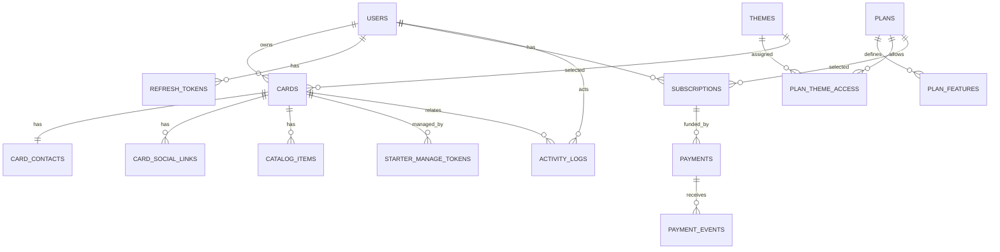
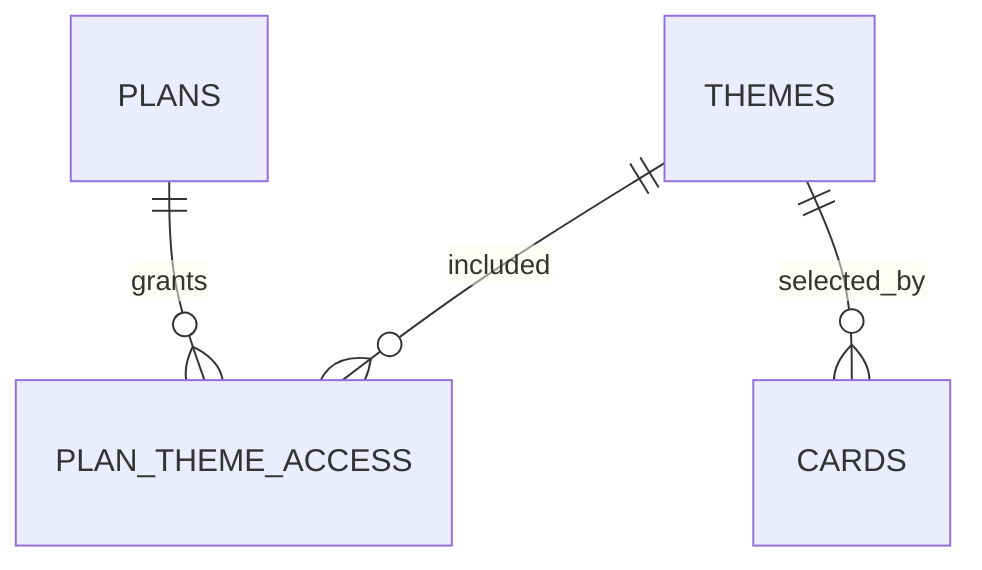

# Database ERD

```mermaid
erDiagram
 USERS ||--o{ CARDS : owns
 CARDS ||--|| CARD_CONTACTS : has
 CARDS ||--o{ CARD_SOCIAL_LINKS : has
 CARDS ||--o{ CATALOG_ITEMS : has
 CARDS ||--o{ STARTER_MANAGE_TOKENS : managed_by
 USERS ||--o{ REFRESH_TOKENS : has
 USERS ||--o{ SUBSCRIPTIONS : has
 PLANS ||--o{ PLAN_FEATURES : defines
 PLANS ||--o{ PLAN_THEME_ACCESS : allows
 THEMES ||--o{ PLAN_THEME_ACCESS : assigned
 THEMES ||--o{ CARDS : selected
 PLANS ||--o{ SUBSCRIPTIONS : selected
 SUBSCRIPTIONS ||--o{ PAYMENTS : funded_by
 PAYMENTS ||--o{ PAYMENT_EVENTS : receives
 USERS ||--o{ ACTIVITY_LOGS : acts
 CARDS ||--o{ ACTIVITY_LOGS : relates
```

Theme relationship:

```mermaid
erDiagram
  PLANS ||--o{ PLAN_THEME_ACCESS : grants
  THEMES ||--o{ PLAN_THEME_ACCESS : included
  THEMES ||--o{ CARDS : selected_by
```
